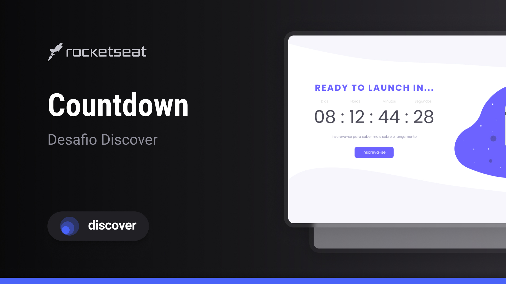

<h1 align="center"> Countdown Timer ⏳</h1>

A temporary page to launch your website.

  <a href="#-technologies">Technologies</a>&nbsp;&nbsp;&nbsp;|&nbsp;&nbsp;&nbsp;
  <a href="#-project">Project</a>&nbsp;&nbsp;&nbsp;|&nbsp;&nbsp;&nbsp;
  <a href="#-layout">Layout</a>&nbsp;&nbsp;&nbsp;|&nbsp;&nbsp;&nbsp;

 

  

## 🚀 Technologies

This project were developed with the following technologies:

- HTML and CSS
- JavaScript
- Git and Github

## 💻 Project

Countdown timer, as the name says, it's a timer to launch a website. You can define how many days you'll need in the script.js file. 

## 🔖 Layout

You can see the design at Figma with [this link](https://www.figma.com/file/lOqWSjQWIrw7HMgIuSae3Z/Countdown-%E2%80%A2-Desafio-Discover-(Community)). You'll need an account on [Figma](https://figma.com) to access it.

---

Thank you for reading! 💕